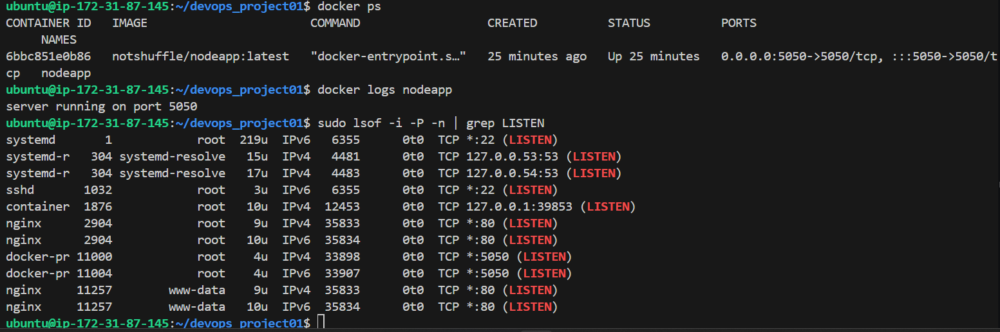
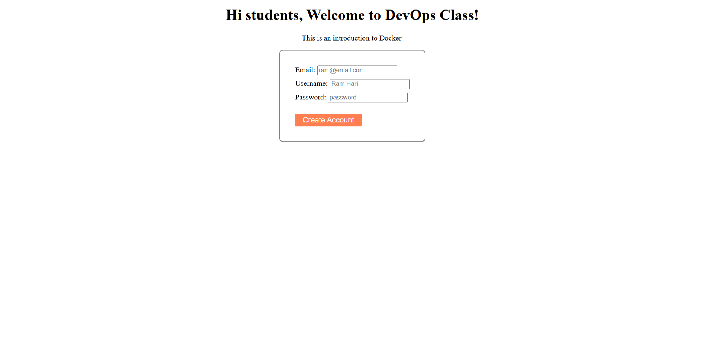

```markdown
# 🚀 DevOps Project: Dockerized Node.js App with NGINX and EC2 Deployment

This project demonstrates end-to-end deployment of a Dockerized Node.js application, reverse-proxied with NGINX, hosted on an AWS EC2 instance. The container image is built and pushed to Docker Hub, with proof-of-deployment screenshots and system validation steps included.

---

## 📦 Project Overview

- 🔧 **Tech Stack**: Node.js, Docker, Docker Hub, NGINX, AWS EC2, Ubuntu
- 🔁 **Workflow**: Local Docker build → Docker Hub push → EC2 pull and run → NGINX reverse proxy
- 🧠 **Skills Practiced**: Containerization, server config, firewall rules, DevOps deployment flow

---

## 📁 Folder Structure

```
devops_project01/
├── Dockerfile
├── package.json
├── server.js
├── .dockerignore
├── .gitignore
├── screenshots/
│   ├── docker image.png
│   ├── EC2 instance.png
│   ├── containers.png
│   ├── inbound rules.png
│   ├── localhost.png
│   └── Screenshot 2025-06-29 123225.png
└── README.md
```

---

## 🐳 Dockerized App

- **Docker Hub Repo**: [`notshuffle/nodeapp`](https://hub.docker.com/r/notshuffle/nodeapp)
- Image Tag: `latest`
- Platform: `linux/amd64`
- Size: ~398 MB
- [x] Pushed successfully to Docker Hub

```bash
docker pull notshuffle/nodeapp:latest
```

---

## 🌐 Deployment Details

- 🖥️ **EC2 Instance**: Ubuntu-based VM hosted in AWS
- 🔀 **NGINX** acts as a reverse proxy routing traffic on port 80 → 5050 (Node container)
- 🔐 **Security Group** rules updated to allow inbound HTTP traffic

---

## 🧪 How to Run Locally

```bash
# Clone repo
git clone https://github.com/notshuffle/devops_project01.git
cd devops_project01

# Build Docker image
docker build -t notshuffle/nodeapp .

# Run container
docker run -p 5050:5050 notshuffle/nodeapp
```

---

## 📸 Screenshots

| Docker Image on Hub | Running Container |
|---------------------|-------------------|
|  |  |

| NGINX Proxy Setup | EC2 Firewall Opened |
|------------------|---------------------|
|  |  |

---

## ✅ Key Wins

- Built and pushed a working image to Docker Hub
- Successfully configured reverse proxy with NGINX
- Resolved EC2 networking, firewall, and access-level issues
- Captured deployment evidence for documentation
- Structured project for reproducibility and future automation

---

## Author

Safal Silwal
📦 GitHub: [notshuffle](https://github.com/notshuffle)  
🐳 Docker Hub: [notshuffle/nodeapp](https://hub.docker.com/r/notshuffle/nodeapp)

---
```

